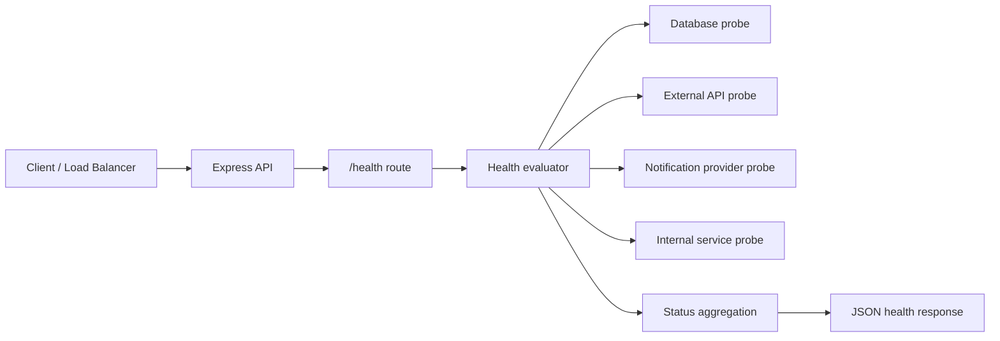

# health_monitoring-healthcheck-sprint

## Problem
This project solves a service reliability problem: teams need a health endpoint that reflects the real state of critical and non-critical dependencies instead of returning a static `"ok"` response. The code in this repo exposes a `/health` API that measures dependency status, captures latency, and distinguishes between full failure and degraded service.

## System Design


- Architecture: a lightweight Express service routes `/health` requests to an evaluator in [`src/health/checks.js`](C:\Users\91965\cars24\github-readme-batch\health_monitoring-healthcheck-sprint\src\health\checks.js), then aggregates per-service results into `ok`, `degraded`, or `fail`.
- Components:
  - API layer: Express in [`src/app.js`](C:\Users\91965\cars24\github-readme-batch\health_monitoring-healthcheck-sprint\src\app.js) and [`src/routes/health.js`](C:\Users\91965\cars24\github-readme-batch\health_monitoring-healthcheck-sprint\src\routes\health.js)
  - Dependency checks: HTTP probes via `axios` plus a local filesystem fallback for database-read simulation
  - Test layer: Jest and Supertest coverage in [`tests/health.test.js`](C:\Users\91965\cars24\github-readme-batch\health_monitoring-healthcheck-sprint\tests\health.test.js)
- There is no LLM, vector DB, or retrieval layer in this repo.

## Approach
- Why multi-agent?
  - Multi-agent is not part of this implementation. The problem here is operational health evaluation, and a single service endpoint is simpler and more reliable than coordinating multiple agents.
- Why RAG?
  - RAG is not used because the endpoint does not retrieve knowledge. It computes live dependency state from direct probes and environment-driven configuration.
- What the code actually does:
  - Treats the database as a critical dependency
  - Treats external services as non-critical dependencies
  - Returns `503` only when a critical dependency fails
  - Preserves `"degraded"` when optional services are down or misconfigured

## Tech Stack
- Node.js 20
- Express
- Axios
- Jest
- Supertest

## Demo
- Start the service with `npm start`
- Hit `GET /health`
- Expected response shape:

```json
{
  "status": "ok",
  "services": {
    "database": { "status": "ok", "latency_ms": 4 },
    "external_api": { "status": "degraded", "error": "missing_configuration", "latency_ms": 1 }
  },
  "latency_ms": 7
}
```

## Results
- The repo does not include production benchmarks, but it does show the intended operational gain:
  - faster diagnosis because dependency-level failures are surfaced explicitly
  - safer alerting because `degraded` and `fail` are separated
  - better testability because health evaluation can be injected and mocked in tests

## Learnings
- What worked:
  - separating route logic from health-check logic made the endpoint easy to test
  - marking only the database as critical keeps optional dependency failures from taking the whole service offline
  - latency capture on every check makes the response more actionable
- What did not:
  - the repo comment in [`src/app.js`](C:\Users\91965\cars24\github-readme-batch\health_monitoring-healthcheck-sprint\src\app.js) still suggests a static health endpoint, while the implementation is now dynamic
  - the database fallback is a filesystem read, which is good for local smoke testing but not a true database connectivity check
